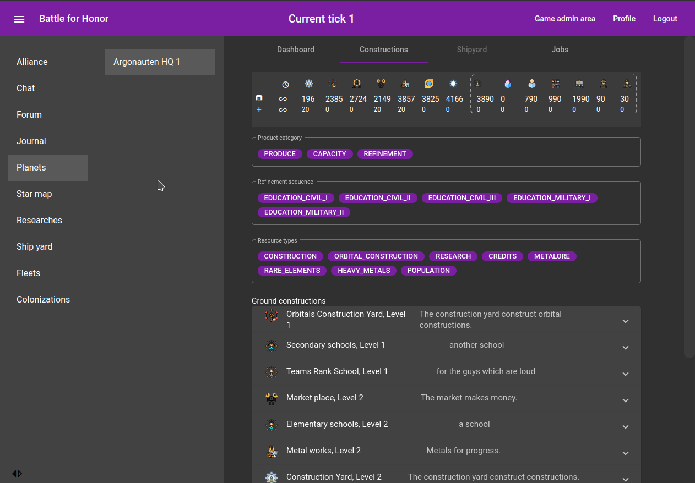
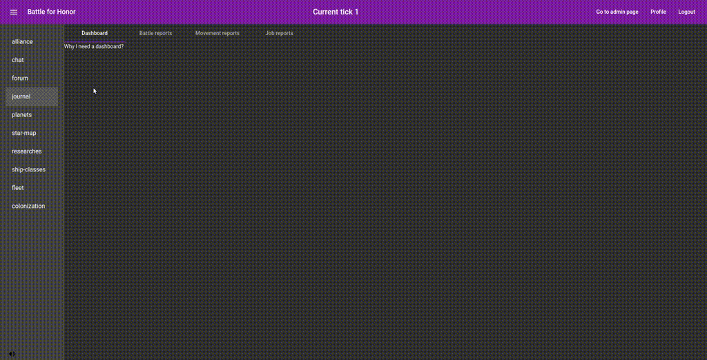
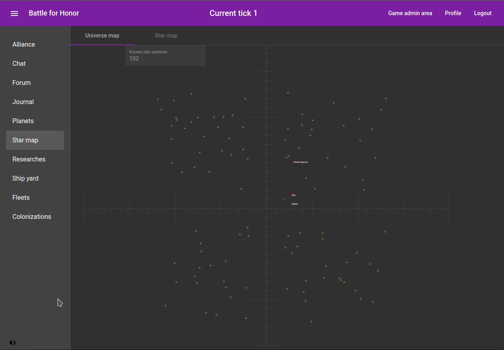
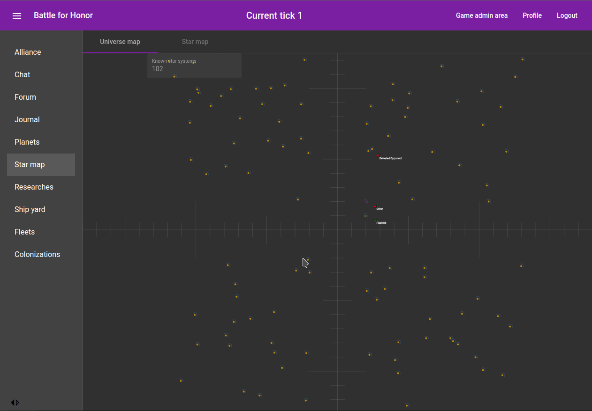
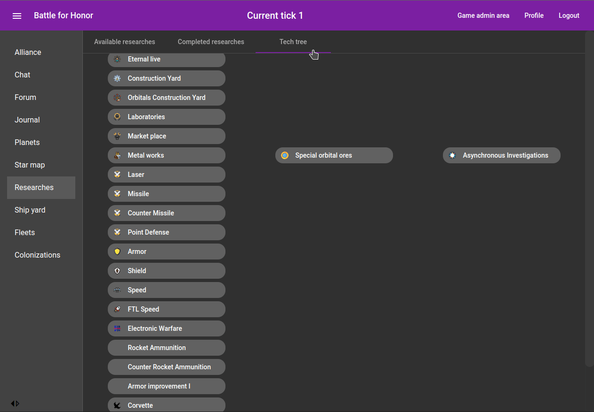
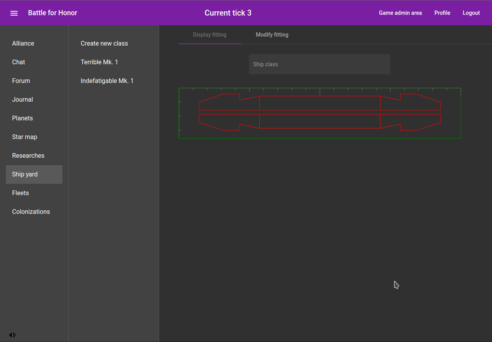

# Battle for Honor

### An honor harrington browser game

Just a simple 4X game which is based on the honorverse created by David Weber.

## State

This is in a very early stage which I would describe as pre-alpha.  
Just register, log in and take a tour.  
Ideally you write a comment in the internal forum to address an issue ;)

It can be accessed via https://www.battleforhonor.de  
And yeah, currently it's plain http without the s. Don't share secrets!

## Impressions

First, the game is in a **really early stage**.

There is no balancing in resources and outputs, in amor values and weapon strength.
Even not in flight speed to distance.

The basic mechanics are implemented and a lot of items are only present.  
But it looks a bit better now.

### Constructions

Next to a lot of other possibilities a 4X game lives from building stuff and using to rule the universe.

So start building constructions on your planet, build fleet, colonize planets and build more fleets.

### Combats

The Combat System allows you strategic interventions, use your fleet to empower your diplomatic corpse to be a little more direct.

The Repeat-Display allows you to evaluate the performance of your fleet setup and commanding officers.

### Movement

But in fact, your fleet is nothing if you cannot be present.

Move to a system of your choice.

And access a planetary orbit.

### Research & Shipyard

To upgrade constructions and technology, some researches must be done.

Then the shipyard can be used to use the upgrades.

### System distribution

This is the backend of the game.

The frontend is located in [another repository](https://github.com/CoderGarm/bfh-frontend).

### Starting the backend for localhost

Set up the database and the application:

1. Check it out, built it, install mariaDB
2. create the database 'sbdb'
3. pipe [createSBDB.sql](data/sql/createSBDB.sql) into the db
4. the initial database state will be created automatically
5. start the application

Set up the frontend:

1. check it out
2. install nodeJS and npm
3. run 'npm start' in base directory

Open the browser at the [start page](http://localhost:4200/#).

### Deployment

1. rebase branch to origin/master and merge branch into master, commit, push
2. run scripts [buildAndCopy.sh](buildAndCopy.sh)
3. jump on medusa - all scripts are placed in home dir
   1. if db patch necessary
      1. run [stopSB.sh](scripts/stopSB.sh)
      2. dump database with [dumpSBDB.sh](scripts/dumpSBDB.sh)
      3. execute new patches from delta folder
   2. run [deployBackend.sh](scripts/deployBackend.sh)
4. tag commit in git by pattern Release-x.x.x(-fix-xYz) 
