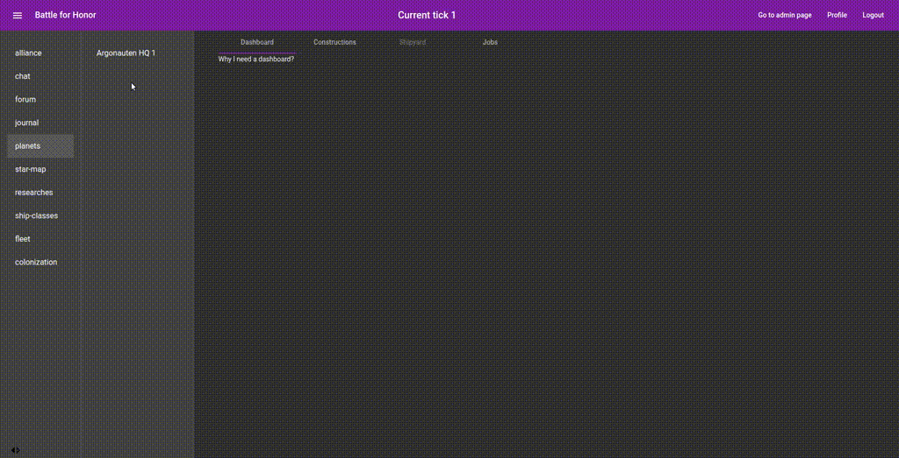
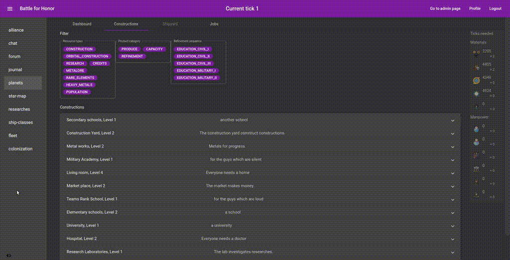
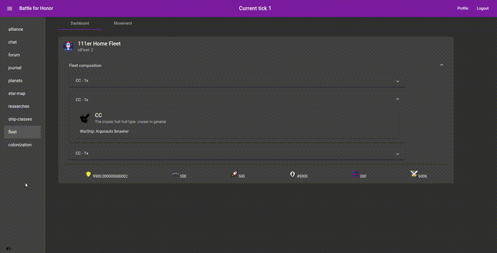

# Battle for Honor

### An honor harrington browser game

Just a simple 4X game which is based on the honorverse created by David Weber.

### System distribution

This is the backend of the game.

The frontend is located in [another repository](https://github.com/CoderGarm/bfh-frontend).

### Starting the backend for localhost

Set up the database and the application:

1. Check it out, built it, install mariaDB
2. create the database 'sbdb'
3. pipe [createSBDB.sql](data/sql/createSBDB.sql) into the db
4. run the test [createInitialData()](src/test/java/de/yuga/spacebattle/backend/services/MasterOfTheUniverseServiceTest.java)
5. start the application

Set up the frontend:

1. check it out
2. install nodeJS and npm
3. run 'npm start' in base directory

Open the browser at the [start page](http://localhost:4200/#).

## Impressions

First, the game is in a **really early stage**.

There is no balancing in resources and outputs, in amor values and weapon strength.
Even not in flight speed to distance.

The basic mechanics are implemented and a lot of items are only present.

### Constructions

Next to a lot of other possibilities a 4X game lives from building stuff and using to rule the universe.

So start building constructions on your planet, build fleet, colonize planets and build more fleets.

### Combats

The Combat System allows you strategic interventions, use your fleet to empower your diplomatic corpse to be a little more direct.

The Repeat-Display allows you to evaluate the performance of your fleet setup and commanding officers.

### Movement

But in fact, your fleet is nothing if you cannot be present.

Move to a system of your choice.

And access a planetary orbit.

